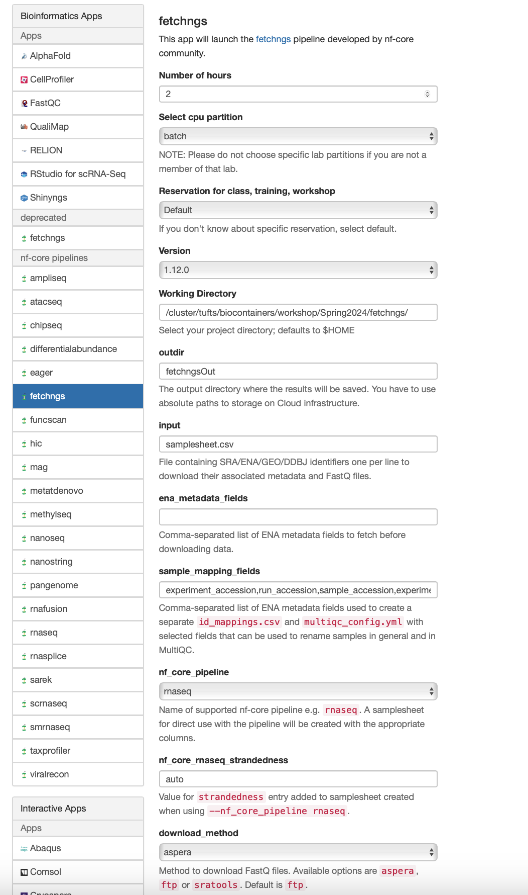

## Reference paper
In this workshop, we will use the RNAseq data from a paper studying the epigenetic regulator `PRMT5` and its obligate cofactor `MEP50` in human.   

From the paper, we learn that the raw data is available in in Gene Expression Omnibus at `GSE80182`.


## Fetchngs
To run the `fetchngs_new` pipeline, we can first create a working directory where the pipeline will run inside. 
In my case, I will use `/cluster/tufts/yzhang85/rt/yzhang85/nf-core_workshp`. You can use your group's project directory as the working directory. **Please do not use your `$HOME`**.
```
mkdir -p /cluster/tufts/yzhang85/rt/yzhang85/nf-core_workshop/fetchngs
cd /cluster/tufts/yzhang85/rt/yzhang85/nf-core_workshop/fetchngs
```

### Create a sampleet.csv as input
```
echo GSE80182 > samplesheet.csv
```

## Open OnDemand
In the demo, we will run the pipeline using the `fetchngs` pipeline deployed on [Tufts Open OnDemand server](https://ondemand.pax.tufts.edu/)

Under `Bioinformatcis Apps`, you can find `fetchngs` within the `nf-core pipelines` subcategory. 

This pipeline is pretty simple. We can leave most parameters as default. 

Below are the arguments we will use:
- Number of hours: 4
- Select cpu partition: batch
- Resveration for class, training, workshop: default
- Version: 1.12.0
- Working Directory: The direcotry your created above. For me, it is `/cluster/tufts/biocontainers/workshop/Spring2024/fetchngs/work`
- Output directory Name: fetchngsOut
- Input: samplesheet.csv
- nf_core_pipeline: rnaseq
- nf_core_rnaseq_strandedness: auto
- download_method: aspera



After you fill in these fields, we can launch now. 

When the job starts, you can click the link after `Session ID: `. If you `view` `outpupt.log`, you can check the running processes of nextflow. 
```
------------------------------------------------------
                                        ,--./,-.
        ___     __   __   __   ___     /,-._.--~'
  |\ | |__  __ /  ` /  \ |__) |__         }  {
  | \| |       \__, \__/ |  \ |___     \`-._,-`-,
                                        `._,._,'
  nf-core/fetchngs v1.12.0
------------------------------------------------------
Core Nextflow options
  runName                   : nasty_fermat
  containerEngine           : singularity
  launchDir                 : /cluster/tufts/biocontainers/workshop/Spring2024/fetchngs
  workDir                   : /cluster/tufts/biocontainers/workshop/Spring2024/fetchngs/work
  projectDir                : /cluster/tufts/biocontainers/nf-core/pipelines/nf-core-fetchngs/1.12.0/1_12_0
  userName                  : yzhang85
  profile                   : tufts
  configFiles               : 

Input/output options
  input                     : samplesheet.csv
  nf_core_pipeline          : rnaseq
  download_method           : aspera
  outdir                    : fetchngsOut

Institutional config options
  config_profile_description: The Tufts University HPC cluster profile provided by nf-core/configs.
  config_profile_contact    : Yucheng Zhang
  config_profile_url        : https://it.tufts.edu/high-performance-computing

Max job request options
  max_cpus                  : 72
  max_memory                : 120 GB
  max_time                  : 7d

!! Only displaying parameters that differ from the pipeline defaults !!
------------------------------------------------------
If you use nf-core/fetchngs for your analysis please cite:

* The pipeline
  https://doi.org/10.5281/zenodo.5070524

* The nf-core framework
  https://doi.org/10.1038/s41587-020-0439-x

* Software dependencies
  https://github.com/nf-core/fetchngs/blob/master/CITATIONS.md
------------------------------------------------------
WARN: The following invalid input values have been detected:

* --partition: batch
* --config_profile_contact_github: @zhan4429
* --config_profile_contact_email: Yucheng.Zhang@tufts.edu
* --igenomes_base: /cluster/tufts/biocontainers/datasets/igenomes/


[-        ] process > NFCORE_FETCHNGS:SRA:SRA_IDS... -
[-        ] process > NFCORE_FETCHNGS:SRA:SRA_RUN... -
[-        ] process > NFCORE_FETCHNGS:SRA:SRA_FAS... -
[-        ] process > NFCORE_FETCHNGS:SRA:FASTQ_D... -
[-        ] process > NFCORE_FETCHNGS:SRA:FASTQ_D... -
[-        ] process > NFCORE_FETCHNGS:SRA:FASTQ_D... -
[-        ] process > NFCORE_FETCHNGS:SRA:ASPERA_CLI -

[-        ] process > NFCORE_FETCHNGS:SRA:SRA_IDS... -
[-        ] process > NFCORE_FETCHNGS:SRA:SRA_RUN... -
[-        ] process > NFCORE_FETCHNGS:SRA:SRA_FAS... -
[-        ] process > NFCORE_FETCHNGS:SRA:FASTQ_D... -
[-        ] process > NFCORE_FETCHNGS:SRA:FASTQ_D... -
[-        ] process > NFCORE_FETCHNGS:SRA:FASTQ_D... -
[-        ] process > NFCORE_FETCHNGS:SRA:ASPERA_CLI -
[-        ] process > NFCORE_FETCHNGS:SRA:SRA_TO_... -
[-        ] process > NFCORE_FETCHNGS:SRA:MULTIQC... -

[-        ] process > NFCORE_FETCHNGS:SRA:SRA_IDS... [  0%] 0 of 1
[-        ] process > NFCORE_FETCHNGS:SRA:SRA_RUN... -
[-        ] process > NFCORE_FETCHNGS:SRA:SRA_FAS... -
[-        ] process > NFCORE_FETCHNGS:SRA:FASTQ_D... -
[-        ] process > NFCORE_FETCHNGS:SRA:FASTQ_D... -
[-        ] process > NFCORE_FETCHNGS:SRA:FASTQ_D... -
[-        ] process > NFCORE_FETCHNGS:SRA:ASPERA_CLI -
[-        ] process > NFCORE_FETCHNGS:SRA:SRA_TO_... -
[-        ] process > NFCORE_FETCHNGS:SRA:MULTIQC... -

executor >  slurm (1)
[4c/4c3aef] process > NFCORE_FETCHNGS:SRA:SRA_IDS... [  0%] 0 of 1
[-        ] process > NFCORE_FETCHNGS:SRA:SRA_RUN... -
[-        ] process > NFCORE_FETCHNGS:SRA:SRA_FAS... -
[-        ] process > NFCORE_FETCHNGS:SRA:FASTQ_D... -
[-        ] process > NFCORE_FETCHNGS:SRA:FASTQ_D... -
[-        ] process > NFCORE_FETCHNGS:SRA:FASTQ_D... -
[-        ] process > NFCORE_FETCHNGS:SRA:ASPERA_CLI -
[-        ] process > NFCORE_FETCHNGS:SRA:SRA_TO_... -
[-        ] process > NFCORE_FETCHNGS:SRA:MULTIQC... -

executor >  slurm (1)
[4c/4c3aef] process > NFCORE_FETCHNGS:SRA:SRA_IDS... [  0%] 0 of 1
[-        ] process > NFCORE_FETCHNGS:SRA:SRA_RUN... -
[-        ] process > NFCORE_FETCHNGS:SRA:SRA_FAS... -
[-        ] process > NFCORE_FETCHNGS:SRA:FASTQ_D... -
[-        ] process > NFCORE_FETCHNGS:SRA:FASTQ_D... -
[-        ] process > NFCORE_FETCHNGS:SRA:FASTQ_D... -
[-        ] process > NFCORE_FETCHNGS:SRA:ASPERA_CLI -
[-        ] process > NFCORE_FETCHNGS:SRA:SRA_TO_... -
[-        ] process > NFCORE_FETCHNGS:SRA:MULTIQC... -

executor >  slurm (2)
[4c/4c3aef] process > NFCORE_FETCHNGS:SRA:SRA_IDS... [100%] 1 of 1 ✔
[c1/d55e6f] process > NFCORE_FETCHNGS:SRA:SRA_RUN... [  0%] 0 of 1
[-        ] process > NFCORE_FETCHNGS:SRA:SRA_FAS... -
[-        ] process > NFCORE_FETCHNGS:SRA:FASTQ_D... -
[-        ] process > NFCORE_FETCHNGS:SRA:FASTQ_D... -
[-        ] process > NFCORE_FETCHNGS:SRA:FASTQ_D... -
[-        ] process > NFCORE_FETCHNGS:SRA:ASPERA_CLI -
[-        ] process > NFCORE_FETCHNGS:SRA:SRA_TO_... -
[-        ] process > NFCORE_FETCHNGS:SRA:MULTIQC... -

executor >  slurm (2)
[4c/4c3aef] process > NFCORE_FETCHNGS:SRA:SRA_IDS... [100%] 1 of 1 ✔
[c1/d55e6f] process > NFCORE_FETCHNGS:SRA:SRA_RUN... [100%] 1 of 1 ✔
[-        ] process > NFCORE_FETCHNGS:SRA:SRA_FAS... -
[-        ] process > NFCORE_FETCHNGS:SRA:FASTQ_D... -
[-        ] process > NFCORE_FETCHNGS:SRA:FASTQ_D... -
[-        ] process > NFCORE_FETCHNGS:SRA:FASTQ_D... -
[-        ] process > NFCORE_FETCHNGS:SRA:ASPERA_CLI -
[-        ] process > NFCORE_FETCHNGS:SRA:SRA_TO_... -
[-        ] process > NFCORE_FETCHNGS:SRA:MULTIQC... -

executor >  slurm (3)
[4c/4c3aef] process > NFCORE_FETCHNGS:SRA:SRA_IDS... [100%] 1 of 1 ✔
[c1/d55e6f] process > NFCORE_FETCHNGS:SRA:SRA_RUN... [100%] 1 of 1 ✔
[-        ] process > NFCORE_FETCHNGS:SRA:SRA_FAS... -
[-        ] process > NFCORE_FETCHNGS:SRA:FASTQ_D... -
[-        ] process > NFCORE_FETCHNGS:SRA:FASTQ_D... -
[-        ] process > NFCORE_FETCHNGS:SRA:FASTQ_D... -
[4b/2b1a84] process > NFCORE_FETCHNGS:SRA:ASPERA_... [  0%] 0 of 9
[-        ] process > NFCORE_FETCHNGS:SRA:SRA_TO_... -
[-        ] process > NFCORE_FETCHNGS:SRA:MULTIQC... -

executor >  slurm (5)
[4c/4c3aef] process > NFCORE_FETCHNGS:SRA:SRA_IDS... [100%] 1 of 1 ✔
[c1/d55e6f] process > NFCORE_FETCHNGS:SRA:SRA_RUN... [100%] 1 of 1 ✔
[-        ] process > NFCORE_FETCHNGS:SRA:SRA_FAS... -
[-        ] process > NFCORE_FETCHNGS:SRA:FASTQ_D... -
[-        ] process > NFCORE_FETCHNGS:SRA:FASTQ_D... -
[-        ] process > NFCORE_FETCHNGS:SRA:FASTQ_D... -
[18/e50208] process > NFCORE_FETCHNGS:SRA:ASPERA_... [  0%] 0 of 9
[-        ] process > NFCORE_FETCHNGS:SRA:SRA_TO_... -
[-        ] process > NFCORE_FETCHNGS:SRA:MULTIQC... -

executor >  slurm (6)
[4c/4c3aef] process > NFCORE_FETCHNGS:SRA:SRA_IDS... [100%] 1 of 1 ✔
[c1/d55e6f] process > NFCORE_FETCHNGS:SRA:SRA_RUN... [100%] 1 of 1 ✔
[-        ] process > NFCORE_FETCHNGS:SRA:SRA_FAS... -
[-        ] process > NFCORE_FETCHNGS:SRA:FASTQ_D... -
[-        ] process > NFCORE_FETCHNGS:SRA:FASTQ_D... -
[-        ] process > NFCORE_FETCHNGS:SRA:FASTQ_D... -
[9b/4f932a] process > NFCORE_FETCHNGS:SRA:ASPERA_... [  0%] 0 of 9
[-        ] process > NFCORE_FETCHNGS:SRA:SRA_TO_... -
[-        ] process > NFCORE_FETCHNGS:SRA:MULTIQC... -

executor >  slurm (8)
[4c/4c3aef] process > NFCORE_FETCHNGS:SRA:SRA_IDS... [100%] 1 of 1 ✔
[c1/d55e6f] process > NFCORE_FETCHNGS:SRA:SRA_RUN... [100%] 1 of 1 ✔
[-        ] process > NFCORE_FETCHNGS:SRA:SRA_FAS... -
[-        ] process > NFCORE_FETCHNGS:SRA:FASTQ_D... -
[-        ] process > NFCORE_FETCHNGS:SRA:FASTQ_D... -
[-        ] process > NFCORE_FETCHNGS:SRA:FASTQ_D... -
[56/5c6fea] process > NFCORE_FETCHNGS:SRA:ASPERA_... [  0%] 0 of 9
[-        ] process > NFCORE_FETCHNGS:SRA:SRA_TO_... -
[-        ] process > NFCORE_FETCHNGS:SRA:MULTIQC... -

executor >  slurm (10)
[4c/4c3aef] process > NFCORE_FETCHNGS:SRA:SRA_IDS... [100%] 1 of 1 ✔
[c1/d55e6f] process > NFCORE_FETCHNGS:SRA:SRA_RUN... [100%] 1 of 1 ✔
[-        ] process > NFCORE_FETCHNGS:SRA:SRA_FAS... -
[-        ] process > NFCORE_FETCHNGS:SRA:FASTQ_D... -
[-        ] process > NFCORE_FETCHNGS:SRA:FASTQ_D... -
[-        ] process > NFCORE_FETCHNGS:SRA:FASTQ_D... -
[47/72d6e2] process > NFCORE_FETCHNGS:SRA:ASPERA_... [  0%] 0 of 9
[-        ] process > NFCORE_FETCHNGS:SRA:SRA_TO_... -
[-        ] process > NFCORE_FETCHNGS:SRA:MULTIQC... -

executor >  slurm (11)
[4c/4c3aef] process > NFCORE_FETCHNGS:SRA:SRA_IDS... [100%] 1 of 1 ✔
[c1/d55e6f] process > NFCORE_FETCHNGS:SRA:SRA_RUN... [100%] 1 of 1 ✔
[-        ] process > NFCORE_FETCHNGS:SRA:SRA_FAS... -
[-        ] process > NFCORE_FETCHNGS:SRA:FASTQ_D... -
[-        ] process > NFCORE_FETCHNGS:SRA:FASTQ_D... -
[-        ] process > NFCORE_FETCHNGS:SRA:FASTQ_D... -
[ca/a10744] process > NFCORE_FETCHNGS:SRA:ASPERA_... [  0%] 0 of 9
[-        ] process > NFCORE_FETCHNGS:SRA:SRA_TO_... -
[-        ] process > NFCORE_FETCHNGS:SRA:MULTIQC... -

executor >  slurm (11)
[4c/4c3aef] process > NFCORE_FETCHNGS:SRA:SRA_IDS... [100%] 1 of 1 ✔
[c1/d55e6f] process > NFCORE_FETCHNGS:SRA:SRA_RUN... [100%] 1 of 1 ✔
[-        ] process > NFCORE_FETCHNGS:SRA:SRA_FAS... -
[-        ] process > NFCORE_FETCHNGS:SRA:FASTQ_D... -
[-        ] process > NFCORE_FETCHNGS:SRA:FASTQ_D... -
[-        ] process > NFCORE_FETCHNGS:SRA:FASTQ_D... -
[ca/a10744] process > NFCORE_FETCHNGS:SRA:ASPERA_... [  0%] 0 of 9
[-        ] process > NFCORE_FETCHNGS:SRA:SRA_TO_... -
[-        ] process > NFCORE_FETCHNGS:SRA:MULTIQC... -

executor >  slurm (11), local (1)
[4c/4c3aef] process > NFCORE_FETCHNGS:SRA:SRA_IDS... [100%] 1 of 1 ✔
[c1/d55e6f] process > NFCORE_FETCHNGS:SRA:SRA_RUN... [100%] 1 of 1 ✔
[-        ] process > NFCORE_FETCHNGS:SRA:SRA_FAS... -
[-        ] process > NFCORE_FETCHNGS:SRA:FASTQ_D... -
[-        ] process > NFCORE_FETCHNGS:SRA:FASTQ_D... -
[-        ] process > NFCORE_FETCHNGS:SRA:FASTQ_D... -
[1d/2add5e] process > NFCORE_FETCHNGS:SRA:ASPERA_... [ 11%] 1 of 9
[96/45f6a6] process > NFCORE_FETCHNGS:SRA:SRA_TO_... [  0%] 0 of 1
[-        ] process > NFCORE_FETCHNGS:SRA:MULTIQC... -

executor >  slurm (11), local (1)
[4c/4c3aef] process > NFCORE_FETCHNGS:SRA:SRA_IDS... [100%] 1 of 1 ✔
[c1/d55e6f] process > NFCORE_FETCHNGS:SRA:SRA_RUN... [100%] 1 of 1 ✔
[-        ] process > NFCORE_FETCHNGS:SRA:SRA_FAS... -
[-        ] process > NFCORE_FETCHNGS:SRA:FASTQ_D... -
[-        ] process > NFCORE_FETCHNGS:SRA:FASTQ_D... -
[-        ] process > NFCORE_FETCHNGS:SRA:FASTQ_D... -
[1d/2add5e] process > NFCORE_FETCHNGS:SRA:ASPERA_... [ 11%] 1 of 9
[96/45f6a6] process > NFCORE_FETCHNGS:SRA:SRA_TO_... [100%] 1 of 1
[-        ] process > NFCORE_FETCHNGS:SRA:MULTIQC... -

executor >  slurm (11), local (2)
[4c/4c3aef] process > NFCORE_FETCHNGS:SRA:SRA_IDS... [100%] 1 of 1 ✔
[c1/d55e6f] process > NFCORE_FETCHNGS:SRA:SRA_RUN... [100%] 1 of 1 ✔
[-        ] process > NFCORE_FETCHNGS:SRA:SRA_FAS... -
[-        ] process > NFCORE_FETCHNGS:SRA:FASTQ_D... -
[-        ] process > NFCORE_FETCHNGS:SRA:FASTQ_D... -
[-        ] process > NFCORE_FETCHNGS:SRA:FASTQ_D... -
[19/082198] process > NFCORE_FETCHNGS:SRA:ASPERA_... [ 22%] 2 of 9
[aa/d0cadf] process > NFCORE_FETCHNGS:SRA:SRA_TO_... [ 50%] 1 of 2
[-        ] process > NFCORE_FETCHNGS:SRA:MULTIQC... -

executor >  slurm (11), local (2)
[4c/4c3aef] process > NFCORE_FETCHNGS:SRA:SRA_IDS... [100%] 1 of 1 ✔
[c1/d55e6f] process > NFCORE_FETCHNGS:SRA:SRA_RUN... [100%] 1 of 1 ✔
[-        ] process > NFCORE_FETCHNGS:SRA:SRA_FAS... -
[-        ] process > NFCORE_FETCHNGS:SRA:FASTQ_D... -
[-        ] process > NFCORE_FETCHNGS:SRA:FASTQ_D... -
[-        ] process > NFCORE_FETCHNGS:SRA:FASTQ_D... -
[19/082198] process > NFCORE_FETCHNGS:SRA:ASPERA_... [ 22%] 2 of 9
[aa/d0cadf] process > NFCORE_FETCHNGS:SRA:SRA_TO_... [100%] 2 of 2
[-        ] process > NFCORE_FETCHNGS:SRA:MULTIQC... -

executor >  slurm (11), local (3)
[4c/4c3aef] process > NFCORE_FETCHNGS:SRA:SRA_IDS... [100%] 1 of 1 ✔
[c1/d55e6f] process > NFCORE_FETCHNGS:SRA:SRA_RUN... [100%] 1 of 1 ✔
[-        ] process > NFCORE_FETCHNGS:SRA:SRA_FAS... -
[-        ] process > NFCORE_FETCHNGS:SRA:FASTQ_D... -
[-        ] process > NFCORE_FETCHNGS:SRA:FASTQ_D... -
[-        ] process > NFCORE_FETCHNGS:SRA:FASTQ_D... -
[9b/4f932a] process > NFCORE_FETCHNGS:SRA:ASPERA_... [ 33%] 3 of 9
[b4/b4a349] process > NFCORE_FETCHNGS:SRA:SRA_TO_... [ 66%] 2 of 3
[-        ] process > NFCORE_FETCHNGS:SRA:MULTIQC... -

executor >  slurm (11), local (4)
[4c/4c3aef] process > NFCORE_FETCHNGS:SRA:SRA_IDS... [100%] 1 of 1 ✔
[c1/d55e6f] process > NFCORE_FETCHNGS:SRA:SRA_RUN... [100%] 1 of 1 ✔
[-        ] process > NFCORE_FETCHNGS:SRA:SRA_FAS... -
[-        ] process > NFCORE_FETCHNGS:SRA:FASTQ_D... -
[-        ] process > NFCORE_FETCHNGS:SRA:FASTQ_D... -
[-        ] process > NFCORE_FETCHNGS:SRA:FASTQ_D... -
[47/72d6e2] process > NFCORE_FETCHNGS:SRA:ASPERA_... [ 44%] 4 of 9
[60/8ad1bf] process > NFCORE_FETCHNGS:SRA:SRA_TO_... [ 75%] 3 of 4
[-        ] process > NFCORE_FETCHNGS:SRA:MULTIQC... -

executor >  slurm (11), local (4)
[4c/4c3aef] process > NFCORE_FETCHNGS:SRA:SRA_IDS... [100%] 1 of 1 ✔
[c1/d55e6f] process > NFCORE_FETCHNGS:SRA:SRA_RUN... [100%] 1 of 1 ✔
[-        ] process > NFCORE_FETCHNGS:SRA:SRA_FAS... -
[-        ] process > NFCORE_FETCHNGS:SRA:FASTQ_D... -
[-        ] process > NFCORE_FETCHNGS:SRA:FASTQ_D... -
[-        ] process > NFCORE_FETCHNGS:SRA:FASTQ_D... -
[47/72d6e2] process > NFCORE_FETCHNGS:SRA:ASPERA_... [ 44%] 4 of 9
[60/8ad1bf] process > NFCORE_FETCHNGS:SRA:SRA_TO_... [100%] 4 of 4
[-        ] process > NFCORE_FETCHNGS:SRA:MULTIQC... -

executor >  slurm (11), local (5)
[4c/4c3aef] process > NFCORE_FETCHNGS:SRA:SRA_IDS... [100%] 1 of 1 ✔
[c1/d55e6f] process > NFCORE_FETCHNGS:SRA:SRA_RUN... [100%] 1 of 1 ✔
[-        ] process > NFCORE_FETCHNGS:SRA:SRA_FAS... -
[-        ] process > NFCORE_FETCHNGS:SRA:FASTQ_D... -
[-        ] process > NFCORE_FETCHNGS:SRA:FASTQ_D... -
[-        ] process > NFCORE_FETCHNGS:SRA:FASTQ_D... -
[4b/2b1a84] process > NFCORE_FETCHNGS:SRA:ASPERA_... [ 55%] 5 of 9
[93/6dbdc2] process > NFCORE_FETCHNGS:SRA:SRA_TO_... [ 80%] 4 of 5
[-        ] process > NFCORE_FETCHNGS:SRA:MULTIQC... -

executor >  slurm (11), local (6)
[4c/4c3aef] process > NFCORE_FETCHNGS:SRA:SRA_IDS... [100%] 1 of 1 ✔
[c1/d55e6f] process > NFCORE_FETCHNGS:SRA:SRA_RUN... [100%] 1 of 1 ✔
[-        ] process > NFCORE_FETCHNGS:SRA:SRA_FAS... -
[-        ] process > NFCORE_FETCHNGS:SRA:FASTQ_D... -
[-        ] process > NFCORE_FETCHNGS:SRA:FASTQ_D... -
[-        ] process > NFCORE_FETCHNGS:SRA:FASTQ_D... -
[56/5c6fea] process > NFCORE_FETCHNGS:SRA:ASPERA_... [ 77%] 7 of 9
[a8/adccd9] process > NFCORE_FETCHNGS:SRA:SRA_TO_... [ 83%] 5 of 6
[-        ] process > NFCORE_FETCHNGS:SRA:MULTIQC... -

executor >  slurm (11), local (7)
[4c/4c3aef] process > NFCORE_FETCHNGS:SRA:SRA_IDS... [100%] 1 of 1 ✔
[c1/d55e6f] process > NFCORE_FETCHNGS:SRA:SRA_RUN... [100%] 1 of 1 ✔
[-        ] process > NFCORE_FETCHNGS:SRA:SRA_FAS... -
[-        ] process > NFCORE_FETCHNGS:SRA:FASTQ_D... -
[-        ] process > NFCORE_FETCHNGS:SRA:FASTQ_D... -
[-        ] process > NFCORE_FETCHNGS:SRA:FASTQ_D... -
[56/5c6fea] process > NFCORE_FETCHNGS:SRA:ASPERA_... [ 77%] 7 of 9
[a8/adccd9] process > NFCORE_FETCHNGS:SRA:SRA_TO_... [ 85%] 6 of 7
[-        ] process > NFCORE_FETCHNGS:SRA:MULTIQC... -

executor >  slurm (11), local (7)
[4c/4c3aef] process > NFCORE_FETCHNGS:SRA:SRA_IDS... [100%] 1 of 1 ✔
[c1/d55e6f] process > NFCORE_FETCHNGS:SRA:SRA_RUN... [100%] 1 of 1 ✔
[-        ] process > NFCORE_FETCHNGS:SRA:SRA_FAS... -
[-        ] process > NFCORE_FETCHNGS:SRA:FASTQ_D... -
[-        ] process > NFCORE_FETCHNGS:SRA:FASTQ_D... -
[-        ] process > NFCORE_FETCHNGS:SRA:FASTQ_D... -
[56/5c6fea] process > NFCORE_FETCHNGS:SRA:ASPERA_... [ 77%] 7 of 9
[64/7dec0f] process > NFCORE_FETCHNGS:SRA:SRA_TO_... [100%] 7 of 7
[-        ] process > NFCORE_FETCHNGS:SRA:MULTIQC... -

executor >  slurm (11), local (9)
[4c/4c3aef] process > NFCORE_FETCHNGS:SRA:SRA_IDS... [100%] 1 of 1 ✔
[c1/d55e6f] process > NFCORE_FETCHNGS:SRA:SRA_RUN... [100%] 1 of 1 ✔
[-        ] process > NFCORE_FETCHNGS:SRA:SRA_FAS... -
[-        ] process > NFCORE_FETCHNGS:SRA:FASTQ_D... -
[-        ] process > NFCORE_FETCHNGS:SRA:FASTQ_D... -
[-        ] process > NFCORE_FETCHNGS:SRA:FASTQ_D... -
[1f/5cb27e] process > NFCORE_FETCHNGS:SRA:ASPERA_... [ 88%] 8 of 9 ✔
[24/ad1814] process > NFCORE_FETCHNGS:SRA:SRA_TO_... [ 87%] 7 of 8
[-        ] process > NFCORE_FETCHNGS:SRA:MULTIQC... -

executor >  slurm (11), local (9)
[4c/4c3aef] process > NFCORE_FETCHNGS:SRA:SRA_IDS... [100%] 1 of 1 ✔
[c1/d55e6f] process > NFCORE_FETCHNGS:SRA:SRA_RUN... [100%] 1 of 1 ✔
[-        ] process > NFCORE_FETCHNGS:SRA:SRA_FAS... -
[-        ] process > NFCORE_FETCHNGS:SRA:FASTQ_D... -
[-        ] process > NFCORE_FETCHNGS:SRA:FASTQ_D... -
[-        ] process > NFCORE_FETCHNGS:SRA:FASTQ_D... -
[ca/a10744] process > NFCORE_FETCHNGS:SRA:ASPERA_... [100%] 9 of 9 ✔
[e6/43d871] process > NFCORE_FETCHNGS:SRA:SRA_TO_... [100%] 9 of 9 ✔
[-        ] process > NFCORE_FETCHNGS:SRA:MULTIQC... -

executor >  slurm (11), local (9)
[4c/4c3aef] process > NFCORE_FETCHNGS:SRA:SRA_IDS... [100%] 1 of 1 ✔
[c1/d55e6f] process > NFCORE_FETCHNGS:SRA:SRA_RUN... [100%] 1 of 1 ✔
[-        ] process > NFCORE_FETCHNGS:SRA:SRA_FAS... -
[-        ] process > NFCORE_FETCHNGS:SRA:FASTQ_D... -
[-        ] process > NFCORE_FETCHNGS:SRA:FASTQ_D... -
[-        ] process > NFCORE_FETCHNGS:SRA:FASTQ_D... -
[ca/a10744] process > NFCORE_FETCHNGS:SRA:ASPERA_... [100%] 9 of 9 ✔
[e6/43d871] process > NFCORE_FETCHNGS:SRA:SRA_TO_... [100%] 9 of 9 ✔
[-        ] process > NFCORE_FETCHNGS:SRA:MULTIQC... [  0%] 0 of 1

executor >  slurm (12), local (9)
[4c/4c3aef] process > NFCORE_FETCHNGS:SRA:SRA_IDS... [100%] 1 of 1 ✔
[c1/d55e6f] process > NFCORE_FETCHNGS:SRA:SRA_RUN... [100%] 1 of 1 ✔
[-        ] process > NFCORE_FETCHNGS:SRA:SRA_FAS... -
[-        ] process > NFCORE_FETCHNGS:SRA:FASTQ_D... -
[-        ] process > NFCORE_FETCHNGS:SRA:FASTQ_D... -
[-        ] process > NFCORE_FETCHNGS:SRA:FASTQ_D... -
[ca/a10744] process > NFCORE_FETCHNGS:SRA:ASPERA_... [100%] 9 of 9 ✔
[e6/43d871] process > NFCORE_FETCHNGS:SRA:SRA_TO_... [100%] 9 of 9 ✔
[95/4af109] process > NFCORE_FETCHNGS:SRA:MULTIQC... [  0%] 0 of 1

executor >  slurm (12), local (9)
[4c/4c3aef] process > NFCORE_FETCHNGS:SRA:SRA_IDS... [100%] 1 of 1 ✔
[c1/d55e6f] process > NFCORE_FETCHNGS:SRA:SRA_RUN... [100%] 1 of 1 ✔
[-        ] process > NFCORE_FETCHNGS:SRA:SRA_FAS... -
[-        ] process > NFCORE_FETCHNGS:SRA:FASTQ_D... -
[-        ] process > NFCORE_FETCHNGS:SRA:FASTQ_D... -
[-        ] process > NFCORE_FETCHNGS:SRA:FASTQ_D... -
[ca/a10744] process > NFCORE_FETCHNGS:SRA:ASPERA_... [100%] 9 of 9 ✔
[e6/43d871] process > NFCORE_FETCHNGS:SRA:SRA_TO_... [100%] 9 of 9 ✔
[95/4af109] process > NFCORE_FETCHNGS:SRA:MULTIQC... [100%] 1 of 1 ✔

executor >  slurm (12), local (9)
[4c/4c3aef] process > NFCORE_FETCHNGS:SRA:SRA_IDS... [100%] 1 of 1 ✔
[c1/d55e6f] process > NFCORE_FETCHNGS:SRA:SRA_RUN... [100%] 1 of 1 ✔
[-        ] process > NFCORE_FETCHNGS:SRA:SRA_FAS... -
[-        ] process > NFCORE_FETCHNGS:SRA:FASTQ_D... -
[-        ] process > NFCORE_FETCHNGS:SRA:FASTQ_D... -
[-        ] process > NFCORE_FETCHNGS:SRA:FASTQ_D... -
[ca/a10744] process > NFCORE_FETCHNGS:SRA:ASPERA_... [100%] 9 of 9 ✔
[e6/43d871] process > NFCORE_FETCHNGS:SRA:SRA_TO_... [100%] 9 of 9 ✔
[95/4af109] process > NFCORE_FETCHNGS:SRA:MULTIQC... [100%] 1 of 1 ✔
-[nf-core/fetchngs] Pipeline completed successfully-
WARN: =============================================================================
  Please double-check the samplesheet that has been auto-created by the pipeline.

  Public databases don't reliably hold information such as strandedness
  information, controls etc

  All of the sample metadata obtained from the ENA has been appended
  as additional columns to help you manually curate the samplesheet before
  running nf-core/other pipelines.
===================================================================================

executor >  slurm (12), local (9)
[4c/4c3aef] process > NFCORE_FETCHNGS:SRA:SRA_IDS... [100%] 1 of 1 ✔
[c1/d55e6f] process > NFCORE_FETCHNGS:SRA:SRA_RUN... [100%] 1 of 1 ✔
[-        ] process > NFCORE_FETCHNGS:SRA:SRA_FAS... -
[-        ] process > NFCORE_FETCHNGS:SRA:FASTQ_D... -
[-        ] process > NFCORE_FETCHNGS:SRA:FASTQ_D... -
[-        ] process > NFCORE_FETCHNGS:SRA:FASTQ_D... -
[ca/a10744] process > NFCORE_FETCHNGS:SRA:ASPERA_... [100%] 9 of 9 ✔
[e6/43d871] process > NFCORE_FETCHNGS:SRA:SRA_TO_... [100%] 9 of 9 ✔
[95/4af109] process > NFCORE_FETCHNGS:SRA:MULTIQC... [100%] 1 of 1 ✔
-[nf-core/fetchngs] Pipeline completed successfully-
WARN: =============================================================================
  Please double-check the samplesheet that has been auto-created by the pipeline.

  Public databases don't reliably hold information such as strandedness
  information, controls etc

  All of the sample metadata obtained from the ENA has been appended
  as additional columns to help you manually curate the samplesheet before
  running nf-core/other pipelines.
===================================================================================
Completed at: 01-Mar-2024 13:39:55
Duration    : 19m 8s
CPU hours   : 8.2
Succeeded   : 21


Cleaning up...
```


### Remember to delete `work/` directory     


