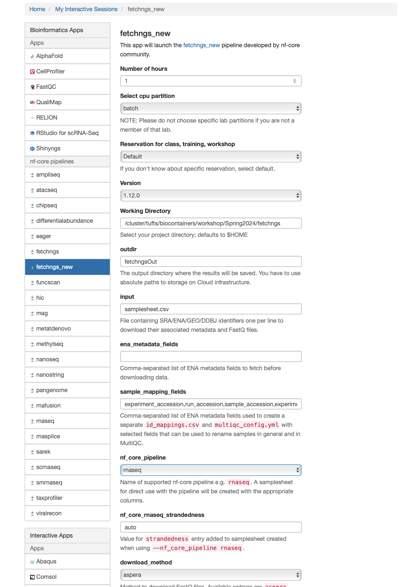

## Reference paper
In this workshop, we will use the RNAseq data from a paper studying the epigenetic regulator `PRMT5` and its obligate cofactor `MEP50` in human.   

From the paper, we learn that the raw data is available in in Gene Expression Omnibus at `GSE80182`.


## Gene exression omnibus (GEO)
https://www.ncbi.nlm.nih.gov/geo/query/acc.cgi?acc=GSE80182


`fetchngs` pipeline is very powerful and supports different kinds of ids, including `SRA/ENA/DDBJ/GEO ids`. We can use `GSE80182` alone to download all datasets. However, in this workshop we only want to use 6 out of 9 samples. To obtain the ids for each sample, you can click `SRA`. 
The 9 samples are from 3 groups: MEP50kd, PRMT50kd, and GTFkd. We only want the 6 samples from PRMT50kd and GTFkd. You can see that their accessions range from SRX1693951 to SRX1693956. 


## Fetchngs
nf-core/fetchngs is a bioinformatics pipeline to fetch metadata and raw FastQ files from both public databases. At present, the pipeline supports SRA / ENA / DDBJ / GEO ids.


To run the `fetchngs` pipeline, we can first create a working directory where the pipeline will run inside. 
In my case, I will use `/cluster/tufts/biocontainers/workshop/Spring2024/fetchngs/`. You can use your group's project directory as the working directory. **Please do not use your `$HOME`**.
```
mkdir -p /cluster/tufts/biocontainers/workshop/Spring2024/fetchngs/
cd /cluster/tufts/biocontainers/workshop/Spring2024/fetchngs/
```

### Create a sampleet.csv as input
```
for i in {3951..3956}
do
   echo "SRX169$i" >> samplesheet.csv
done
```

```
cat samplesheet.csv 
```

```
SRX1693951
SRX1693952
SRX1693953
SRX1693954
SRX1693955
SRX1693956
```
## Open OnDemand
In the demo, we will run the pipeline using the `fetchngs` pipeline deployed on [Tufts Open OnDemand server](https://ondemand.pax.tufts.edu/)

Under `Bioinformatcis Apps`, you can find `fetchngs` within the `nf-core pipelines` subcategory. 

This pipeline is pretty simple. We can leave most parameters as default. 

Below are the arguments we will use:
- Number of hours: 4
- Select cpu partition: batch
- Resveration for class, training, workshop: default
- Version: 1.12.0
- Working Directory: The direcotry your created above. For me, it is `/cluster/tufts/biocontainers/workshop/Spring2024/fetchngs`
- Output directory Name: fetchngsOut
- Input: samplesheet.csv
- nf_core_pipeline: rnaseq
- nf_core_rnaseq_strandedness: auto
- download_method: aspera



After you fill in these fields, we can launch now. 

When the job starts, you can click the link after `Session ID: `. If you `view` `outpupt.log`, you can check the running processes of nextflow. 
```
------------------------------------------------------
                                        ,--./,-.
        ___     __   __   __   ___     /,-._.--~'
  |\ | |__  __ /  ` /  \ |__) |__         }  {
  | \| |       \__, \__/ |  \ |___     \`-._,-`-,
                                        `._,._,'
  nf-core/fetchngs v1.12.0
------------------------------------------------------
Core Nextflow options
  runName                   : irreverent_rutherford
  containerEngine           : singularity
  launchDir                 : /cluster/tufts/biocontainers/workshop/Spring2024/fetchngs
  workDir                   : /cluster/tufts/biocontainers/workshop/Spring2024/fetchngs/work
  projectDir                : /cluster/tufts/biocontainers/nf-core/pipelines/nf-core-fetchngs/1.12.0/1_12_0
  userName                  : yzhang85
  profile                   : tufts
  configFiles               : 

Input/output options
  input                     : samplesheet.csv
  nf_core_pipeline          : rnaseq
  download_method           : aspera
  outdir                    : fetchngsOut

Institutional config options
  config_profile_description: The Tufts University HPC cluster profile provided by nf-core/configs.
  config_profile_contact    : Yucheng Zhang
  config_profile_url        : https://it.tufts.edu/high-performance-computing

Max job request options
  max_cpus                  : 72
  max_memory                : 120 GB
  max_time                  : 7d

!! Only displaying parameters that differ from the pipeline defaults !!
------------------------------------------------------
If you use nf-core/fetchngs for your analysis please cite:

* The pipeline
  https://doi.org/10.5281/zenodo.5070524

* The nf-core framework
  https://doi.org/10.1038/s41587-020-0439-x

* Software dependencies
  https://github.com/nf-core/fetchngs/blob/master/CITATIONS.md
------------------------------------------------------
WARN: The following invalid input values have been detected:

* --partition: batch
* --config_profile_contact_github: @zhan4429
* --config_profile_contact_email: Yucheng.Zhang@tufts.edu
* --igenomes_base: /cluster/tufts/biocontainers/datasets/igenomes/


[-        ] process > NFCORE_FETCHNGS:SRA:SRA_IDS... -
[-        ] process > NFCORE_FETCHNGS:SRA:SRA_RUN... -
[-        ] process > NFCORE_FETCHNGS:SRA:SRA_FAS... -

[-        ] process > NFCORE_FETCHNGS:SRA:SRA_IDS... -
[-        ] process > NFCORE_FETCHNGS:SRA:SRA_RUN... -
[-        ] process > NFCORE_FETCHNGS:SRA:SRA_FAS... -
[-        ] process > NFCORE_FETCHNGS:SRA:FASTQ_D... -
[-        ] process > NFCORE_FETCHNGS:SRA:FASTQ_D... -
[-        ] process > NFCORE_FETCHNGS:SRA:FASTQ_D... -
[-        ] process > NFCORE_FETCHNGS:SRA:ASPERA_CLI -
[-        ] process > NFCORE_FETCHNGS:SRA:SRA_TO_... -
[-        ] process > NFCORE_FETCHNGS:SRA:MULTIQC... -

[-        ] process > NFCORE_FETCHNGS:SRA:SRA_IDS... [  0%] 0 of 2
[-        ] process > NFCORE_FETCHNGS:SRA:SRA_RUN... -
[-        ] process > NFCORE_FETCHNGS:SRA:SRA_FAS... -
[-        ] process > NFCORE_FETCHNGS:SRA:FASTQ_D... -
[-        ] process > NFCORE_FETCHNGS:SRA:FASTQ_D... -
[-        ] process > NFCORE_FETCHNGS:SRA:FASTQ_D... -
[-        ] process > NFCORE_FETCHNGS:SRA:ASPERA_CLI -
[-        ] process > NFCORE_FETCHNGS:SRA:SRA_TO_... -
[-        ] process > NFCORE_FETCHNGS:SRA:MULTIQC... -

.
.
.

executor >  slurm (19), local (6)
[81/8a2aaa] process > NFCORE_FETCHNGS:SRA:SRA_IDS... [100%] 6 of 6 ✔
[4f/ee3a77] process > NFCORE_FETCHNGS:SRA:SRA_RUN... [100%] 6 of 6 ✔
[-        ] process > NFCORE_FETCHNGS:SRA:SRA_FAS... -
[-        ] process > NFCORE_FETCHNGS:SRA:FASTQ_D... -
[-        ] process > NFCORE_FETCHNGS:SRA:FASTQ_D... -
[-        ] process > NFCORE_FETCHNGS:SRA:FASTQ_D... -
[54/cf3d1d] process > NFCORE_FETCHNGS:SRA:ASPERA_... [100%] 6 of 6 ✔
[cb/3d036d] process > NFCORE_FETCHNGS:SRA:SRA_TO_... [100%] 6 of 6 ✔
[0f/409afa] process > NFCORE_FETCHNGS:SRA:MULTIQC... [  0%] 0 of 1

executor >  slurm (19), local (6)
[81/8a2aaa] process > NFCORE_FETCHNGS:SRA:SRA_IDS... [100%] 6 of 6 ✔
[4f/ee3a77] process > NFCORE_FETCHNGS:SRA:SRA_RUN... [100%] 6 of 6 ✔
[-        ] process > NFCORE_FETCHNGS:SRA:SRA_FAS... -
[-        ] process > NFCORE_FETCHNGS:SRA:FASTQ_D... -
[-        ] process > NFCORE_FETCHNGS:SRA:FASTQ_D... -
[-        ] process > NFCORE_FETCHNGS:SRA:FASTQ_D... -
[54/cf3d1d] process > NFCORE_FETCHNGS:SRA:ASPERA_... [100%] 6 of 6 ✔
[cb/3d036d] process > NFCORE_FETCHNGS:SRA:SRA_TO_... [100%] 6 of 6 ✔
[0f/409afa] process > NFCORE_FETCHNGS:SRA:MULTIQC... [100%] 1 of 1 ✔
-[nf-core/fetchngs] Pipeline completed successfully-
WARN: =============================================================================
  Please double-check the samplesheet that has been auto-created by the pipeline.

  Public databases don't reliably hold information such as strandedness
  information, controls etc

  All of the sample metadata obtained from the ENA has been appended
  as additional columns to help you manually curate the samplesheet before
  running nf-core/other pipelines.
===================================================================================

executor >  slurm (19), local (6)
[81/8a2aaa] process > NFCORE_FETCHNGS:SRA:SRA_IDS... [100%] 6 of 6 ✔
[4f/ee3a77] process > NFCORE_FETCHNGS:SRA:SRA_RUN... [100%] 6 of 6 ✔
[-        ] process > NFCORE_FETCHNGS:SRA:SRA_FAS... -
[-        ] process > NFCORE_FETCHNGS:SRA:FASTQ_D... -
[-        ] process > NFCORE_FETCHNGS:SRA:FASTQ_D... -
[-        ] process > NFCORE_FETCHNGS:SRA:FASTQ_D... -
[54/cf3d1d] process > NFCORE_FETCHNGS:SRA:ASPERA_... [100%] 6 of 6 ✔
[cb/3d036d] process > NFCORE_FETCHNGS:SRA:SRA_TO_... [100%] 6 of 6 ✔
[0f/409afa] process > NFCORE_FETCHNGS:SRA:MULTIQC... [100%] 1 of 1 ✔
-[nf-core/fetchngs] Pipeline completed successfully-
WARN: =============================================================================
  Please double-check the samplesheet that has been auto-created by the pipeline.

  Public databases don't reliably hold information such as strandedness
  information, controls etc

  All of the sample metadata obtained from the ENA has been appended
  as additional columns to help you manually curate the samplesheet before
  running nf-core/other pipelines.
===================================================================================
Completed at: 02-Mar-2024 18:15:53
Duration    : 11m 9s
CPU hours   : 3.0
Succeeded   : 25


Cleaning up...
```


### Remember to delete `work/` directory     


### nextflow clean
```
cd /cluster/tufts/biocontainers/workshop/Spring2024/fetchngs
module load nextflow
nextflow log
```

You should see some useful runtime information of completed jobs in the current directory. We can also use the `RUN NAME` and `nextflow clean` to clean the `work` directory. In this case, the `RUN NAME` is `irreverent_rutherford`.
```
TIMESTAMP          	DURATION	RUN NAME             	STATUS	REVISION ID	SESSION ID                          	COMMAND                                                                                                                                                
2024-03-02 18:04:43	11m 10s 	irreverent_rutherford	OK    	0f0b67958c 	9a5c876b-5c30-48c2-b55e-48677363f295	nextflow run /cluster/tufts/biocontainers/nf-core/pipelines/nf-core-fetchngs/1.12.0/1_12_0 -params-file nf-params.json -profile tufts --partition batch
```

```
$ nextflow clean -f irreverent_rutherford
Removed /cluster/tufts/biocontainers/workshop/Spring2024/fetchngs/work/f5/74497ebf3f36efad09ebee8519ecef
Removed /cluster/tufts/biocontainers/workshop/Spring2024/fetchngs/work/7b/178457f133774858a5d10e852523f6
Removed /cluster/tufts/biocontainers/workshop/Spring2024/fetchngs/work/98/7ddfa1cf4613615bfcecb6ecf167c6
Removed /cluster/tufts/biocontainers/workshop/Spring2024/fetchngs/work/cc/902cb642aed4dd1850839a7fe75071
Removed /cluster/tufts/biocontainers/workshop/Spring2024/fetchngs/work/d4/32dbdf8949e9f0d4587be17d4fc389
Removed /cluster/tufts/biocontainers/workshop/Spring2024/fetchngs/work/81/8a2aaa2778e136340e164d0bb3b32b
Removed /cluster/tufts/biocontainers/workshop/Spring2024/fetchngs/work/79/ed8e515c7254f134a3ce64c7950338
Removed /cluster/tufts/biocontainers/workshop/Spring2024/fetchngs/work/6d/0f7a5dda1757f73707679db3679a6c
Removed /cluster/tufts/biocontainers/workshop/Spring2024/fetchngs/work/94/89f0f178a6c8d4c89f002488ef7210
Removed /cluster/tufts/biocontainers/workshop/Spring2024/fetchngs/work/0d/7d12d9af85cb90948451ce8c0b19c9
Removed /cluster/tufts/biocontainers/workshop/Spring2024/fetchngs/work/9e/c00aee33d6aef6a0a89da09c9e5cd9
Removed /cluster/tufts/biocontainers/workshop/Spring2024/fetchngs/work/4f/ee3a77e70b291a6e25dae4585df441
Removed /cluster/tufts/biocontainers/workshop/Spring2024/fetchngs/work/fc/5fb242a14185a9436cce712e2b6c0e
Removed /cluster/tufts/biocontainers/workshop/Spring2024/fetchngs/work/18/9177c2cb956a008bb56aeaa2a3a017
Removed /cluster/tufts/biocontainers/workshop/Spring2024/fetchngs/work/5b/ea1a20f00545b992bd1859c5610491
Removed /cluster/tufts/biocontainers/workshop/Spring2024/fetchngs/work/26/a54f3214a0027f03a1fe283cae9a27
Removed /cluster/tufts/biocontainers/workshop/Spring2024/fetchngs/work/28/bd7c27332450b8bece51e146095f93
Removed /cluster/tufts/biocontainers/workshop/Spring2024/fetchngs/work/54/cf3d1d89eb40b606212f258fb67952
Removed /cluster/tufts/biocontainers/workshop/Spring2024/fetchngs/work/37/ef25f395f24219da52ac358b28e3da
Removed /cluster/tufts/biocontainers/workshop/Spring2024/fetchngs/work/9e/2d06e438872212d93e3d8bb6c62cb6
Removed /cluster/tufts/biocontainers/workshop/Spring2024/fetchngs/work/57/81810c59f69ae020ea55fc06dc8f34
Removed /cluster/tufts/biocontainers/workshop/Spring2024/fetchngs/work/a7/64edfa8692cf35cb95604635b24d89
Removed /cluster/tufts/biocontainers/workshop/Spring2024/fetchngs/work/18/9486c4cb3ffb0e1692b032757d012e
Removed /cluster/tufts/biocontainers/workshop/Spring2024/fetchngs/work/cb/3d036ddc1e77fde9620839c3c0c733
Removed /cluster/tufts/biocontainers/workshop/Spring2024/fetchngs/work/0f/409afa1c6ded02885970255b88da06
```
